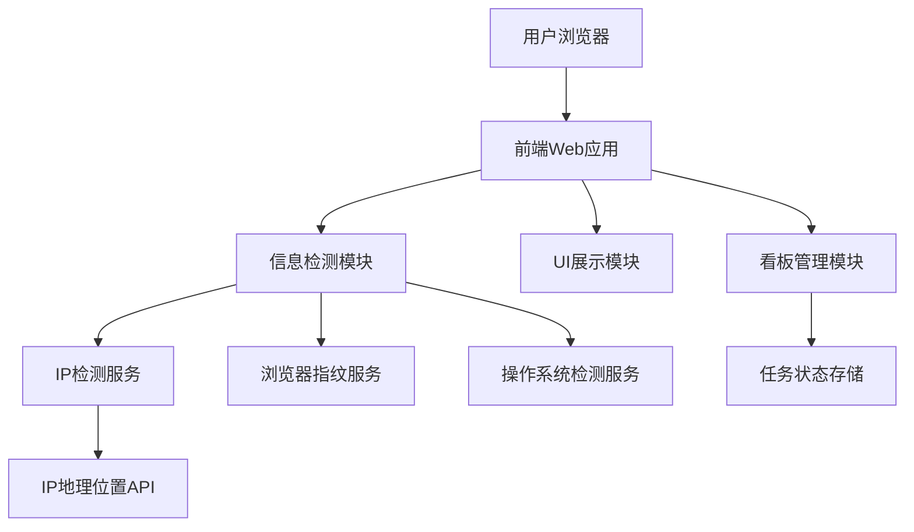

# 设计文档

## 概述

用户信息检测器是一个基于web的单页应用，当用户访问时自动检测并展示IP归属地、浏览器指纹和操作系统信息。系统采用前端JavaScript实现信息收集，后端API提供IP地理位置查询服务，并集成看板工具进行任务管理。

## 架构

### 系统架构图



### 技术栈

- **前端**: HTML5, CSS3, JavaScript (ES6+)
- **后端**: Node.js + Express.js
- **IP地理位置服务**: 第三方API (如ipapi.co或类似服务)
- **数据存储**: LocalStorage (任务状态), JSON文件 (配置)
- **看板工具**: 自定义实现或集成现有工具

## 组件和接口

### 1. 前端组件

#### InfoDetector 主组件
```javascript
class InfoDetector {
  constructor()
  async detectAllInfo()
  renderResults(data)
  showLoading()
  hideLoading()
}
```

#### IPDetectionService
```javascript
class IPDetectionService {
  async getUserIP()
  async getGeolocation(ip)
}
```

#### BrowserFingerprintService  
```javascript
class BrowserFingerprintService {
  getUserAgent()
  getScreenResolution()
  getPlugins()
  generateFingerprint()
}
```

#### OSDetectionService
```javascript
class OSDetectionService {
  parseUserAgent(userAgent)
  detectOSType()
  detectOSVersion()
}
```

#### KanbanManager
```javascript
class KanbanManager {
  loadTasks()
  updateTaskStatus(taskId, status)
  renderKanban()
  saveTaskState()
}
```

### 2. 后端API接口

#### IP地理位置查询
```
GET /api/geolocation/:ip
Response: {
  ip: string,
  country: string,
  region: string,
  city: string,
  latitude: number,
  longitude: number
}
```

#### 任务管理API
```
GET /api/tasks
POST /api/tasks/:id/status
Response: {
  id: string,
  title: string,
  status: 'todo' | 'in-progress' | 'done',
  timestamp: string
}
```

## 数据模型

### UserInfo 数据模型
```javascript
interface UserInfo {
  ip: {
    address: string;
    geolocation: {
      country: string;
      region: string;
      city: string;
      coordinates?: {
        lat: number;
        lng: number;
      };
    };
  };
  browser: {
    userAgent: string;
    fingerprint: string;
    screenResolution: string;
    plugins: string[];
  };
  os: {
    type: string;
    version: string;
    platform: string;
  };
}
```

### Task 数据模型
```javascript
interface Task {
  id: string;
  title: string;
  description: string;
  status: 'todo' | 'in-progress' | 'done';
  createdAt: Date;
  updatedAt: Date;
  acceptanceCriteria: string[];
}
```

### KanbanBoard 数据模型
```javascript
interface KanbanBoard {
  id: string;
  title: string;
  columns: {
    todo: Task[];
    inProgress: Task[];
    done: Task[];
  };
}
```

## 正确性属性

*属性是一个特征或行为，应该在系统的所有有效执行中保持为真——本质上是关于系统应该做什么的正式声明。属性作为人类可读规范和机器可验证正确性保证之间的桥梁。*

### 属性 1: IP检测和地理位置展示
*对于任何*有效的用户访问，系统应该能够获取IP地址、查询地理位置信息并在UI上正确展示，如果地理位置无法解析则显示适当的错误信息
**验证需求: 1.1, 1.2, 1.3, 1.4**

### 属性 2: 浏览器指纹生成和展示
*对于任何*浏览器环境，系统应该能够收集User-Agent、屏幕分辨率、插件信息，生成唯一指纹并在UI上展示详细信息
**验证需求: 2.1, 2.2, 2.3, 2.4, 2.5**

### 属性 3: 操作系统识别和展示
*对于任何*User-Agent字符串，系统应该能够解析操作系统类型和版本并在UI上展示，无法识别时显示"未知操作系统"
**验证需求: 3.1, 3.2, 3.3, 3.4, 3.5**

### 属性 4: 信息整合展示
*对于任何*检测完成的用户信息，系统应该在单个页面按指定顺序展示所有结果，并在加载过程中显示状态指示器
**验证需求: 4.1, 4.2, 4.3**

### 属性 5: 看板状态管理
*对于任何*任务状态变化，看板应该实时更新并正确显示"待办"、"进行中"、"已完成"三种状态
**验证需求: 5.2, 5.3, 5.4, 5.5**

### 属性 6: 任务生命周期管理
*对于任何*任务，系统应该记录开始时间、完成时间、验收结果，支持依赖关系管理并提供进度可视化
**验证需求: 6.2, 6.3, 6.4, 6.5**

## 错误处理

### 网络错误处理
- IP地理位置API不可用时的降级处理
- 网络超时的重试机制
- API限流的处理策略

### 数据验证
- IP地址格式验证
- User-Agent字符串的安全性检查
- 浏览器兼容性检测

### 用户体验
- 加载失败时的友好提示
- 部分信息获取失败时的优雅降级
- 刷新和重试功能

## 测试策略

### 双重测试方法
系统将采用单元测试和基于属性的测试相结合的方法：

**单元测试**：
- 验证特定示例和边缘情况
- 测试错误条件和异常处理
- 验证组件间的集成点
- 测试UI组件的特定行为

**基于属性的测试**：
- 验证跨所有输入的通用属性
- 通过随机化实现全面的输入覆盖
- 每个属性测试运行最少100次迭代
- 每个测试必须引用其设计文档属性

**属性测试配置**：
- 使用JavaScript的fast-check库进行基于属性的测试
- 每个属性测试标记格式：**Feature: user-info-detector, Property {number}: {property_text}**
- 最少100次迭代确保随机化覆盖
- 每个正确性属性由单个基于属性的测试实现

**测试覆盖范围**：
- IP检测和地理位置查询的各种场景
- 不同浏览器和操作系统的指纹生成
- UI组件在各种数据状态下的行为
- 看板任务管理的状态转换
- 错误处理和边缘情况

### 集成测试
- 端到端用户流程测试
- API集成测试
- 跨浏览器兼容性测试
- 响应式设计测试